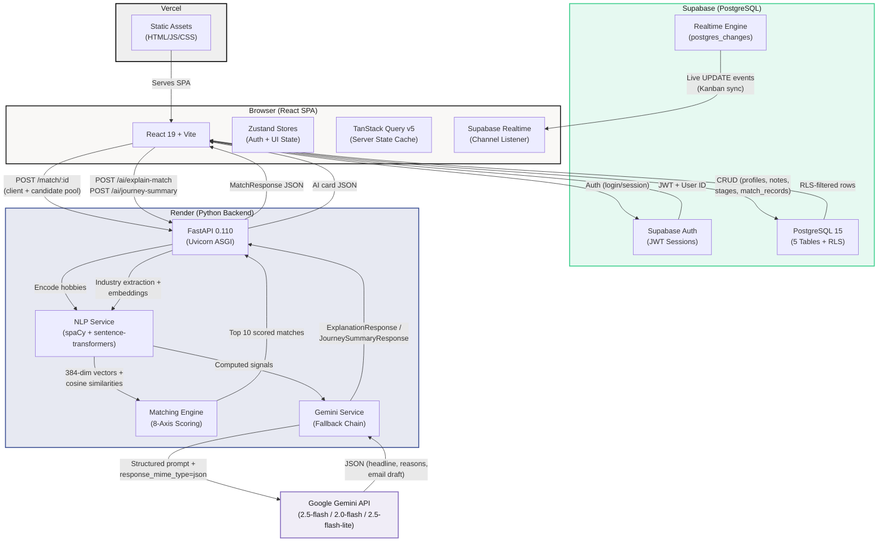

# Parinay

*Internal matchmaking CRM and AI-powered matching engine for The Date Crew — India's premium human-led matchmaking service.*

[](https://parinay.vercel.app)
[](https://fastapi.tiangolo.com/)
[](https://react.dev/)
[](LICENSE)

**[Live Demo](https://parinay.vercel.app)** | **[API Docs (Swagger)](https://parinay-api.onrender.com/docs)**

---

## Overview

Parinay is an internal CRM and AI-assisted matching engine built for The Date Crew's matchmaker team. It provides matchmakers with a unified workspace to manage client profiles, run a gender-specific compatibility algorithm against a pool of candidates, and generate AI-powered match explanation cards with editable introduction emails. This is not a client-facing product — it is an operational tool designed to help matchmakers work faster and with more context. Built as an internship assignment submission for The Date Crew's Full Stack Developer Intern role.

---

## Architecture



The system has three distinct data paths, each chosen for a specific reason:

**Path 1 — CRM Operations (Frontend to Supabase Direct)**
All CRUD operations — reading the client list, updating profile stages, adding notes, recording sent introductions — go directly from the React frontend to Supabase's PostgREST API using the `@supabase/supabase-js` client. This eliminates a round-trip through the Python backend for simple database operations. Row Level Security policies on all 5 tables ensure each matchmaker can only access their own assigned clients and the shared dummy pool. Supabase Realtime pushes `postgres_changes` events back to the frontend so the Kanban board stays in sync across browser tabs without polling.

**Path 2 — Matching Pipeline (Frontend to Backend to Supabase)**
When a matchmaker clicks "Find Matches," the frontend fetches the opposite-gender dummy pool from Supabase (cached by TanStack Query for 10 minutes), then sends both the client profile and full candidate pool to `POST /match/{client_id}` on the FastAPI backend. The backend encodes the client's hobbies into a 384-dimensional vector via sentence-transformers, computes cosine similarity against every candidate, then runs the gender-specific scoring engine (hard filters followed by 8 weighted axes). The top 10 results above the 40-point threshold are returned. This computation happens server-side because spaCy and sentence-transformers require Python and ~400MB of model state that loads once at startup via FastAPI's lifespan context manager.

**Path 3 — AI Generation (Backend to Gemini)**
When a matchmaker opens the Send Match drawer, the frontend calls `POST /ai/explain-match`. The backend first runs NLP preprocessing — spaCy extracts industries from company/designation fields, sentence-transformers computes interest similarity — then assembles a structured context object with pre-computed signals (age delta, kids alignment, lifestyle score, geography situation). This context is sent to Gemini with `response_mime_type=application/json` so the model returns structured JSON directly. A three-model fallback chain (gemini-2.5-flash, gemini-2.0-flash, gemini-2.5-flash-lite) with a final static fallback ensures the matchmaker always gets a usable explanation card, even under rate limits. The same pattern applies to the Client Journey Summary endpoint, which digests notes and stage history into a 3-sentence overview.

---

## Screenshots

> Screenshots will be added after deployment.

## Features

| Feature | Description |
|---|---|
| Matchmaker Login + RLS Isolation | Supabase Auth with Row Level Security — each matchmaker sees only their assigned clients, enforced at the database layer |
| Client CRM with Stage Tracking | Full profile management across 10 pipeline stages (New through Closed) with timestamped audit logs |
| Gender-Specific Matching Algorithm | Separate scoring functions for male and female clients with different hard filters, 8 weighted scoring axes, and NLP interest similarity |
| AI Match Explanation Card (Gemini) | Structured JSON response with headline, 3 compatibility reasons, talking point chips, and editable intro email draft |
| Client Journey AI Summary | 3-sentence digest generated from a client's full note history and stage timeline for fast context pickup |
| Kanban Pipeline with Drag-and-Drop | 8-column board with @dnd-kit, optimistic updates, stage history audit trail, and Supabase Realtime sync across tabs |
| Check-In Alert Engine | Client-side computation of overdue contacts, due-soon alerts, and feedback-pending flags displayed in a daily digest sidebar |
| Supabase Realtime Live Updates | PostgreSQL change notifications via Supabase channels — Kanban board auto-refreshes when a profile is updated in another tab |
| Render Cold-Start Retry with Friendly UI | Two-attempt strategy with a "waking up" loading state that retries automatically after the backend spins up from Render's free tier |
| Luxury/Editorial Design System | Playfair Display + Inter font pairing, warm neutral palette, Framer Motion page transitions, and Lenis smooth scrolling throughout |

---

## Tech Stack

### Frontend

| Layer | Technology | Purpose |
|---|---|---|
| Framework | React 19 + Vite 8 | SPA with fast HMR — SEO irrelevant for internal tool |
| Styling | Tailwind CSS v4 | Utility-first CSS with @tailwindcss/vite plugin for zero-config setup |
| State (Client) | Zustand 5 | Lightweight stores for auth session and UI state (active view toggle) |
| State (Server) | TanStack Query v5 | Server state, caching, background refetch, and optimistic mutation handling |
| Animation | Framer Motion 12 | Cinematic page transitions, staggered list animations, and drawer slide-ins |
| Smooth Scroll | @studio-freight/lenis | Global and scoped smooth scrolling (match result list, Kanban horizontal scroll, client detail panel) |
| Drag-and-Drop | @dnd-kit/core + sortable | Kanban card dragging with 8px activation constraint to prevent accidental drags on click |
| Icons | Lucide React | Minimal, consistent icon set across the UI |
| Charts | Recharts | Data visualization in the daily digest sidebar |
| HTTP Client | Axios | API communication with the Python backend, including cold-start retry logic |
| Auth + DB Client | @supabase/supabase-js | Direct Supabase queries, Realtime channel subscriptions, and Auth session management |
| Notifications | react-hot-toast | Minimal toast notifications styled to match the editorial design system |
| Routing | react-router-dom v7 | Client-side routing with auth guards |
| Fonts | Playfair Display + Inter | Luxury/editorial font pairing loaded via Google Fonts |

### Backend + Infrastructure

| Layer | Technology | Purpose |
|---|---|---|
| Framework | Python + FastAPI 0.110 | Async API server — chosen because the NLP stack and Gemini SDK are Python-native |
| Validation | Pydantic v2 | Request/response models with field validators, model validators, and computed properties |
| NLP — Tokenization | spaCy 3.7 (en_core_web_sm) | Named entity recognition for industry extraction from company/designation fields |
| NLP — Embeddings | sentence-transformers (all-MiniLM-L6-v2) | 384-dimensional hobby/interest embeddings for cosine similarity scoring |
| AI Generation | Google Gemini API (gemini-2.5-flash) | Match explanation cards and client journey summaries with structured JSON output |
| ML Runtime | PyTorch 2.4 (CPU-only) | Tensor backend for sentence-transformers — pinned to +cpu to fit Render's 512MB RAM |
| Database | Supabase (PostgreSQL 15) | Managed Postgres with Auth, Row Level Security, Realtime, and REST API |
| Frontend Hosting | Vercel | Zero-config static deployment with automatic preview branches |
| Backend Hosting | Render (Free Tier) | Docker-based Python deployment with 512MB RAM and cold-start spindown |
| ASGI Server | Uvicorn | Production-grade ASGI server for FastAPI |

---

## Getting Started

### Frontend

**Prerequisites:** Node.js 18+, npm

```bash
cd tdc-frontend
npm install
npm run dev
```

**Environment Variables** — create `tdc-frontend/.env`:

| Name | Required | Description |
|---|---|---|
| `VITE_SUPABASE_URL` | Yes | Supabase project URL (`https://<ref>.supabase.co`) |
| `VITE_SUPABASE_ANON_KEY` | Yes | Supabase public anon key (safe for client-side use) |
| `VITE_BACKEND_URL` | Yes | Backend API base URL (`http://localhost:8000` for local dev) |

### Backend

**Prerequisites:** Python 3.11+, pip

```bash
cd tdc-backend
python -m venv .venv
.venv\Scripts\activate        # Windows
# source .venv/bin/activate   # macOS/Linux
pip install -r requirements.txt
python -m spacy download en_core_web_sm
uvicorn main:app --reload
```

**Environment Variables** — create `tdc-backend/.env` (see `.env.example`):

| Name | Required | Description |
|---|---|---|
| `SUPABASE_URL` | Yes | Supabase project URL |
| `SUPABASE_SERVICE_ROLE_KEY` | Yes | Service role key (server-side only — bypasses RLS for matching pool queries) |
| `GEMINI_API_KEY` | Yes | Google Gemini API key for AI explanation and summary generation |
| `FRONTEND_ORIGIN` | Yes | Allowed CORS origin (`http://localhost:5173` for local, Vercel URL for prod) |

> The backend must be running before using the matching features. The frontend polls `GET /health` and disables the "Find Matches" button until `models_loaded: true`.

---

## Database Setup

The database is configured through 5 SQL files and 1 seed script, executed in the Supabase SQL Editor in this order:

1. **`00_extensions.sql`** — Enable `uuid-ossp` and `pgcrypto` extensions
2. **`01_schema.sql`** — Create all 5 tables: `matchmakers`, `profiles`, `notes`, `stage_history`, `match_records` with constraints, computed columns, and indexes
3. **`02_triggers.sql`** — Age computation trigger (`fn_set_profile_age`), `updated_at` auto-update, and `last_contacted_at` bump on note insert
4. **`03_rls.sql`** — Enable Row Level Security on every public table with per-matchmaker isolation policies on `profiles` and `notes`
5. **`04_seed_matchmakers.sql`** — Insert matchmaker accounts into both `auth.users` and the `matchmakers` table with bcrypt-hashed passwords
6. **`06_seed_demo_clients.js`** / **`seed.js`** — Node.js scripts that insert 240 realistic dummy profiles (120M + 120F) reflecting TDC's actual clientele demographics

After seeding, run **`05_verify.sql`** to validate table counts, RLS enforcement, trigger behavior, and index presence.

---

## Demo Access

| Account | Email | Password | Note |
|---|---|---|---|
| Demo Matchmaker | `matchmaker@tdc.demo` | `TDC@demo2026` | Evaluator access — use this account to explore the full application |
| Kawaljeet Kaur | `kawaljeet@thedatecrew.com` | `TDC@intern2026` | Sees only Kawaljeet's assigned clients (RLS-isolated) |
| Shimpi Sharma | `shimpi@thedatecrew.com` | `TDC@intern2026` | Sees only Shimpi's assigned clients (RLS-isolated) |

> **Cold Start Note:** The backend runs on Render's free tier and spins down after 15 minutes of inactivity. The first matching request after inactivity may take 10-15 seconds. The UI shows a "waking up" state and retries automatically. The `/health` endpoint is pinged on dashboard load to wake the service early.

---

## Technical Decisions, Matching Logic & AI Integration

The frontend is built with React 19 and Vite, chosen for fast HMR and SPA architecture since SEO is irrelevant for an internal tool. Tailwind CSS v4 powers the Luxury/Editorial design system with a warm neutral palette and sharp typographic hierarchy. Zustand handles lightweight auth and UI state, while TanStack Query v5 manages all server state with caching, background refetch, and optimistic updates. Framer Motion drives cinematic page transitions and staggered list animations throughout the dashboard and client detail views. Lenis.js is applied both globally and to individual scroll containers — the match result list, Kanban horizontal scroll, and client detail left panel — for smooth inertia scrolling that matches the editorial feel. @dnd-kit/core powers the Kanban drag-and-drop with an 8px activation constraint to prevent accidental drags on click. On the backend, Python and FastAPI were chosen because the NLP stack (spaCy, sentence-transformers) and Gemini SDK are Python-native. Pydantic v2 validates all request and response models with field validators, model validators, and computed properties. FastAPI's lifespan context manager loads both NLP models once at startup into `app.state` — never per-request — keeping RAM within Render free tier's 512MB limit. The database layer is Supabase (PostgreSQL with Auth and Realtime). Row Level Security ensures each matchmaker sees only their assigned clients, enforced at the database layer rather than the application layer, which matters because Supabase's PostgREST endpoint is reachable with the public anon key. Supabase Realtime powers live Kanban updates across browser tabs. Deployment uses Vercel for the frontend (zero-config) and Render for the backend (free tier with cold-start handling).

The matching algorithm has two entirely separate scoring functions — one for male clients, one for female clients — reflecting different compatibility priorities in the Indian matrimonial context. For male clients, hard filters eliminate candidates where the woman is older, significantly taller (>3cm), earns more than 115% of the client's income, or has an incompatible kids preference. For female clients, hard filters eliminate candidates where the man is younger, shorter by more than 2cm, earns less than 80% of her income, or is more than 8 years older. Both functions apply the same 8 scoring axes with different weightings: kids preference (25pts — always the highest, a dealbreaker axis), relocation compatibility (15pts male / 20pts female — weighted higher for female clients because relocation is a top concern per TDC's own content), lifestyle alignment across diet, drink, and smoke (15pts), education parity (15pts), geographic feasibility (15pts male / 10pts female), religion and caste preference (10pts, with "Same Only" as a hard filter not a soft score), age delta within stated preference range (5pts), and a semantic interest similarity NLP bonus (up to 10pts). Raw scores are normalized to 0-100 and labeled: High Potential Match (80+), Good Match (60-79), Possible (40-59). Candidates below 40 are excluded from results.

AI is integrated in two places. The primary use is the Match Explanation Card: when a matchmaker clicks Send Match, the Python backend runs NLP preprocessing — spaCy extracts industry from company and designation fields, sentence-transformers (all-MiniLM-L6-v2) encodes both profiles' hobbies into 384-dimensional vectors and computes cosine similarity — then assembles a structured context object and calls Gemini 2.5 Flash with `response_mime_type=application/json`. Gemini returns a JSON card with a headline, three specific compatibility reasons grounded in actual profile data (not generic platitudes), three talking point chips, and a full intro email draft — all editable by the matchmaker before sending. A fallback chain (gemini-2.5-flash, gemini-2.0-flash, gemini-2.5-flash-lite, then a static fallback built from real profile data) handles rate limits automatically with no user-visible errors. The second AI use is a Client Journey Summary button in the notes panel — Gemini reads the client's full note history and stage timeline and generates a 3-sentence digest for fast context when a matchmaker picks up a client mid-process. Key assumptions: this MVP assumes manual data entry by matchmakers (no integration with TDC's application form or Magic Link system). Income is stored in INR — NRI clients use the INR equivalent. Email delivery is mocked — the Send Introduction action logs to Supabase and confirms via toast, but no actual email is dispatched (SendGrid/Resend integration is post-MVP). The matching pool consists of 240 pre-seeded realistic dummy profiles. Same-gender matching and multi-matchmaker client handoff are out of scope for this version. The Gemini API key used is a personal key for demonstration — TDC would replace it with their own in production.

---

## Project Structure

```
Parinay/
├── tdc-frontend/                    # React + Vite application
│   ├── index.html                   # HTML entry — Playfair Display + Inter font loading
│   ├── vite.config.js               # Vite + React + Tailwind CSS v4 plugin
│   ├── package.json
│   └── src/
│       ├── App.jsx                  # Router, auth guards, Lenis init, QueryClientProvider
│       ├── main.jsx                 # React DOM entry point
│       ├── index.css                # Global styles, editorial design tokens
│       ├── pages/
│       │   ├── Login.jsx            # Supabase Auth login form
│       │   ├── Dashboard.jsx        # Main workspace — table/kanban toggle, search, filters
│       │   ├── ClientDetail.jsx     # Full client profile, matching panel, notes, stage changer
│       │   └── NotFound.jsx         # 404 page
│       ├── components/
│       │   ├── dashboard/
│       │   │   ├── ClientTable.jsx   # Sortable client list view
│       │   │   ├── KanbanBoard.jsx   # Drag-and-drop pipeline with Realtime sync
│       │   │   ├── KanbanColumn.jsx  # Individual Kanban stage column
│       │   │   ├── DailyDigest.jsx   # Alert sidebar — overdue, due soon, feedback pending
│       │   │   ├── AlertBadge.jsx    # Visual indicator for alert counts
│       │   │   └── StageTag.jsx      # Styled stage label component
│       │   ├── client/
│       │   │   ├── ProfileCard.jsx   # Client profile display card
│       │   │   ├── SectionBlock.jsx  # Reusable collapsible section wrapper
│       │   │   ├── StageChanger.jsx  # Stage transition dropdown with audit logging
│       │   │   ├── NotesList.jsx     # Chronological matchmaker notes feed
│       │   │   ├── AddNoteForm.jsx   # Note input with Supabase insert
│       │   │   └── MatchHistory.jsx  # Past introductions sent for this client
│       │   ├── matching/
│       │   │   ├── MatchPanel.jsx    # Match trigger, results list, score display
│       │   │   ├── MatchCard.jsx     # Individual match result card
│       │   │   ├── ScoreBadge.jsx    # Color-coded score label (High/Good/Possible)
│       │   │   └── ScoreBreakdown.jsx # 8-axis score breakdown visualization
│       │   └── modals/
│       │       └── SendMatchModal.jsx # AI explanation card + editable intro email drawer
│       ├── hooks/
│       │   ├── useClients.js         # TanStack Query hook for client list
│       │   ├── useClientDetail.js    # Single client fetch with notes + stage history
│       │   ├── useMatches.js         # Match mutation with cold-start retry logic
│       │   ├── useCheckInAlerts.js   # Client-side alert computation
│       │   └── useLenis.js           # Global and scoped Lenis smooth scroll hooks
│       ├── store/
│       │   ├── authStore.js          # Zustand store — session, user, init, signOut
│       │   └── uiStore.js            # Zustand store — active view (table/kanban)
│       ├── lib/
│       │   ├── supabase.js           # Supabase client initialization
│       │   ├── axios.js              # Axios instance with backend base URL
│       │   └── queryClient.js        # TanStack Query client configuration
│       └── utils/
│           ├── formatters.js         # Date, income, and display formatting utilities
│           └── alertComputer.js      # Check-in alert logic (overdue, due soon thresholds)
│
├── tdc-backend/                     # Python FastAPI service
│   ├── main.py                      # FastAPI app — lifespan model loading, CORS, routers, /health
│   ├── requirements.txt             # Pinned deps with CPU-only PyTorch + version conflict notes
│   ├── .env.example                 # Environment variable template
│   ├── models/
│   │   ├── profile.py               # Pydantic v2 model mirroring the profiles table schema
│   │   ├── match_request.py         # Request model for POST /match/{client_id}
│   │   ├── match_response.py        # Response model — MatchResult, ScoreBreakdown
│   │   └── ai_models.py             # Request/response models for Gemini AI endpoints
│   ├── routers/
│   │   ├── matching.py              # POST /match/{client_id} — orchestrates NLP + scoring engine
│   │   └── ai.py                    # POST /ai/explain-match, POST /ai/journey-summary
│   ├── services/
│   │   ├── matching_engine.py       # Core algorithm — hard filters + 8 scoring axes per gender
│   │   ├── nlp_service.py           # spaCy NER, sentence-transformer embeddings, industry taxonomy
│   │   └── gemini_service.py        # Gemini fallback chain, match explanation, journey summary
│   ├── utils/
│   │   └── supabase_client.py       # Supabase service-role client initialization
│   ├── 00_extensions.sql            # Enable uuid-ossp + pgcrypto
│   ├── 01_schema.sql                # 5 tables with constraints, computed columns, indexes
│   ├── 02_triggers.sql              # Age computation, updated_at, last_contacted_at triggers
│   ├── 03_rls.sql                   # Row Level Security policies for all public tables
│   ├── 04_seed_matchmakers.sql      # Auth + matchmakers table seeding with bcrypt passwords
│   ├── 05_verify.sql                # Validation queries for post-setup verification
│   ├── 06_seed_demo_clients.js      # 240 realistic dummy profiles (120M + 120F)
│   └── seed.js                      # Alternative seed script for demo client generation
│
└── README.md
```

---

## Deployment

### Vercel (Frontend)

1. Connect the repository and set the **Root Directory** to `tdc-frontend`
2. Set the following environment variables:

| Variable | Value |
|---|---|
| `VITE_SUPABASE_URL` | Your Supabase project URL |
| `VITE_SUPABASE_ANON_KEY` | Your Supabase anon key |
| `VITE_BACKEND_URL` | Your Render backend URL (e.g. `https://parinay-api.onrender.com`) |

3. Build command: `npm run build` | Output directory: `dist`

### Render (Backend)

1. Create a new **Web Service** and set the **Root Directory** to `tdc-backend`
2. Set the following environment variables:

| Variable | Value |
|---|---|
| `SUPABASE_URL` | Your Supabase project URL |
| `SUPABASE_SERVICE_ROLE_KEY` | Your Supabase service role key |
| `GEMINI_API_KEY` | Your Google Gemini API key |
| `FRONTEND_ORIGIN` | Your Vercel frontend URL (e.g. `https://parinay.vercel.app`) |

3. **Build Command** (must include the spaCy model download):
   ```
   pip install -r requirements.txt && pip install https://github.com/explosion/spacy-models/releases/download/en_core_web_sm-3.7.1/en_core_web_sm-3.7.1-py3-none-any.whl
   ```
4. **Start Command:**
   ```
   uvicorn main:app --host 0.0.0.0 --port $PORT
   ```

> Render Build Command must include the spaCy model download. The `python -m spacy download` approach can fail behind Render's compatibility-table lookup — installing the wheel directly is more reliable.

---

## Assignment Submission

| | |
|---|---|
| **Submitted to** | The Date Crew |
| **Contact** | tech@thedatecrew.com |
| **Role applied** | Full Stack Developer Intern |
| **Author** | Jeet Darji |

---

## License

This project is licensed under the [MIT License](LICENSE).
